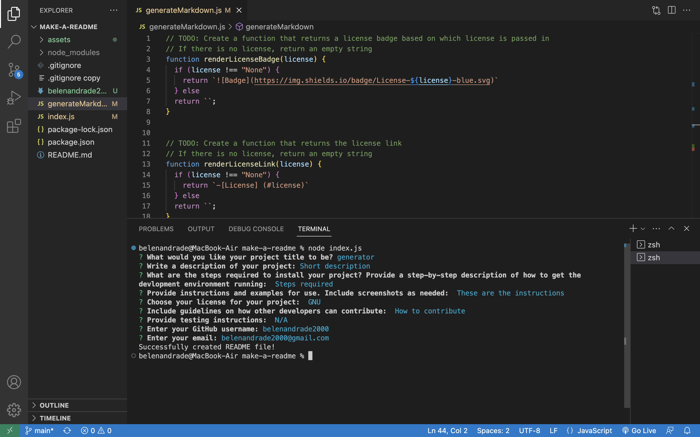
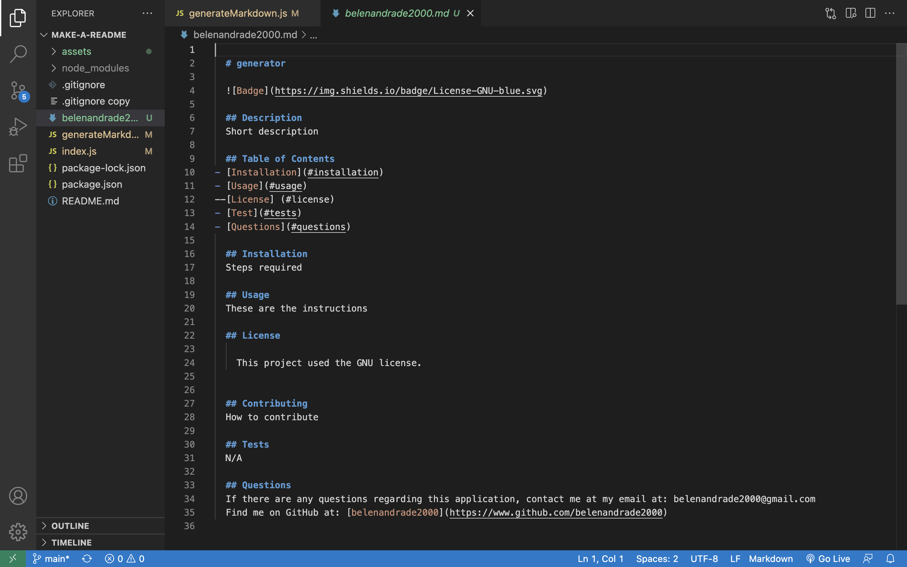

# make-a-readme

## Description

Creating a README file can sometimes feel redundant. It is the same headers and sometimes the content is very similar. In the coding world, there is an acronym of DRY (Don't Repear Yourself). For that reason, developers are always creating and finding ways to make their lives easier and cease from writing the same thing again and again. This application offers that by using node to prompt the user with README questions that will be appended onto a README template. For example, instead of writing, "The license I used for this application is ..." everytime you make a README, now this application will write that sentence for you and all you have to do is select the license you used from a list of options. Essentially, this project prompts the user with questions in the terminal that the user can input their answers. Once the last questions is answered, a readme file will be created in the VScode folder area. In this project, I learned more about inquirer and npm packages and their purpose in coding. 

## Table of Contents

- [Installation](#installation)
- [Usage](#usage)
- [Credits](#credits)
- [License](#license)

## Installation

Make sure npm inquirer is installed as well as npm init -y. 

## Usage

Head to the index.js file in vs code of the "make-a-readme" folder. Right click on that file and open the integrated terminal. Once the terminal pops up, write the code "node index.js".Several questions will pop up one by one after that starting with the question "What would you like your project title to be?". All the questions will need input for the answers or choosing an option from a list. To choose from a list, use the up and down arrows to scroll, use space to select, and enter to move on to the next prompt question. Once the user puts in the input for the last question asking for the user email, a response saying "Succesfully created README file!" will show. In the folder area of the project in vscode, a new file will show called {github username}.md. 

## Credits

N/A

## License

Please refer to Github repository.

ScreenCastify link: https://drive.google.com/file/d/1XDeNghnsvnXJROdnANz5EG1TME1BHbuR/view

